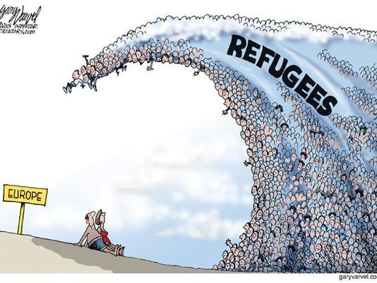
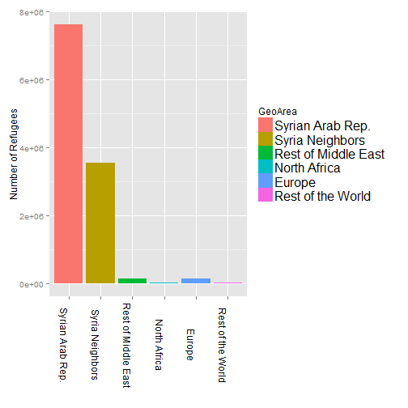
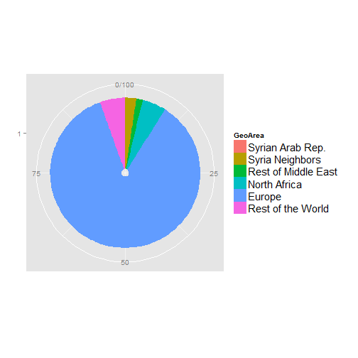

Where do Syrian Refugees go?
========================================================
author: LeGru
date: Sun Dec 27 12:11:10 2015

What is happening?
========================================================

The newspapers show masses of people pressing at European's borders

Is Europe being invaded?

Are all Syrian refugeess going to Europe?

***

Data to answer these questions...
========================================================

Data from UNHCR tells the story of all World refugees

If we look at Refugees out of Syria we see where they are...

... They are still in Syria trying to weather the war and go home

... if they live they stop in Turkey, or in Lebanon

... Very few of them go to Europe

***

 

But hey wait a minute...
========================================================

There is something unexpected in the data

Look at the Asylum numbers...

Refugees look for asylum in Europe:  when they will be discouraged they will all go there!

May be,  but what if they needs Asylum to stay in Europe,  but do not need it to stay in other countries?

***

 

Conclusion
========================================================

The Syrian Refugees crises is reported to be the worse since WWII

It is moving millions of people in a World already shacken but huge migrations

Dara can help us to understand what is going  and make up our mind on how to react

*To the rewiers:*

* *The presentation was created with rPubs*
* *The graphs in the previous slides were generated with the same function used in the web app*
* *The code is available on github at:*
